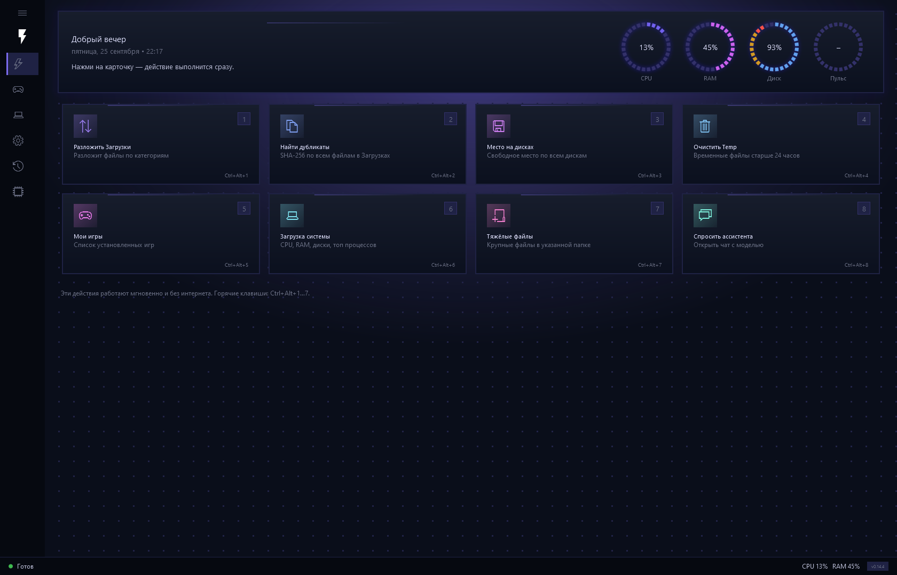
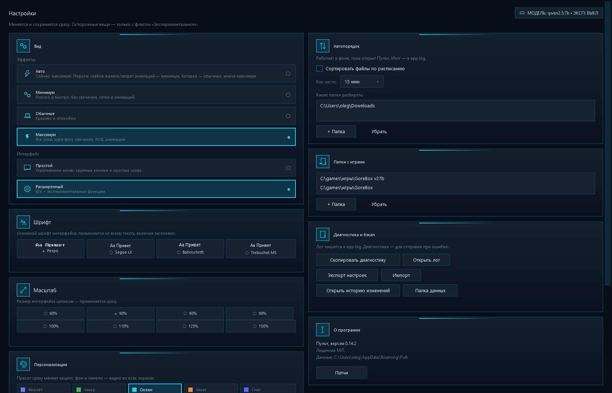
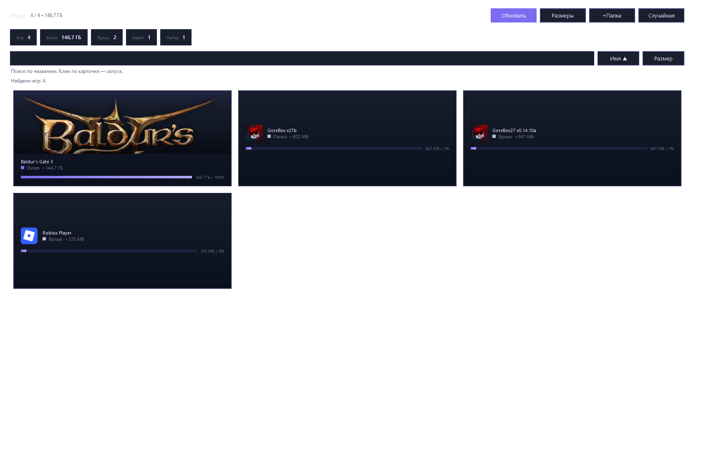
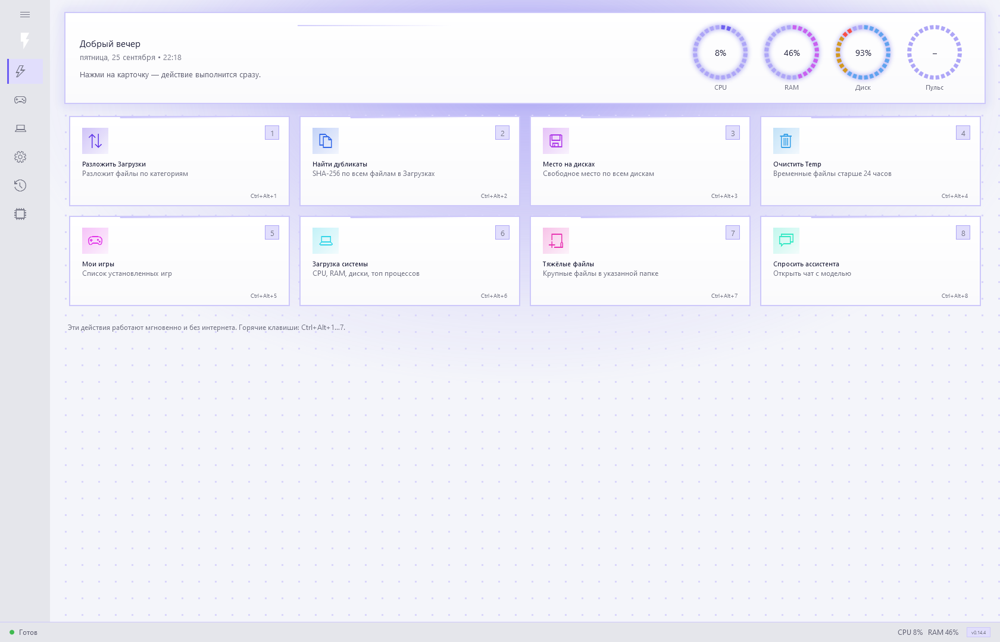
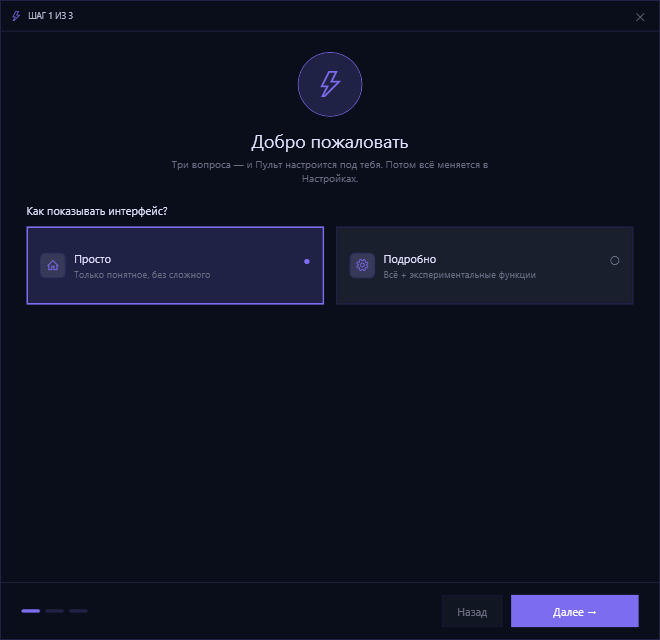
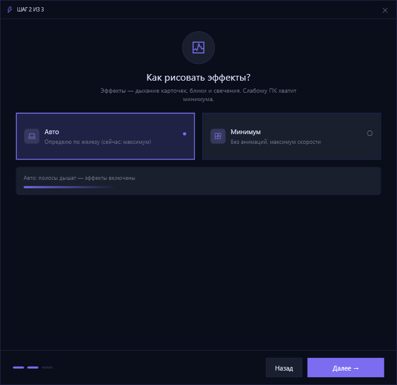
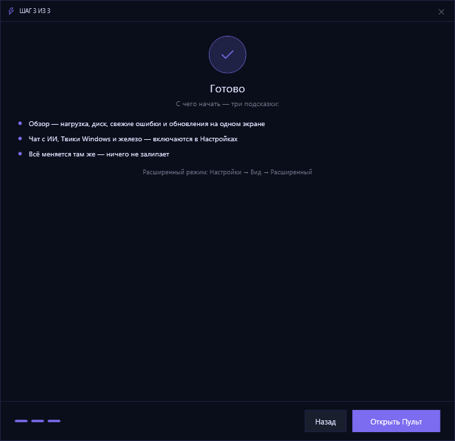
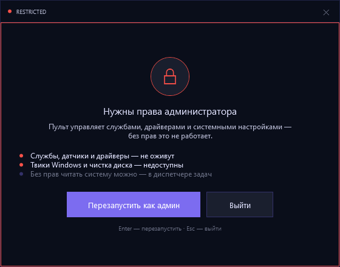

# Пульт

Десктоп-панель управления для Windows: системный монитор, твики и приватность,
чат с локальной языковой моделью, библиотека игр, журнал действий с откатом.
Тёмный «приборный» интерфейс в стиле шкалы приборов, виджет поверх окон,
пошаговый мастер первого запуска.

WPF · C# · .NET 10 · всё локально.






## Возможности

- **Действия** — плитки мгновенных действий и hero с кольцами CPU / RAM / Диск.
- **Дом** (Простой интерфейс) — светофор состояния, «Проверить всё»,
  цепочки из одной кнопки.
- **Система** — 21 плашка в шести вкладках: обзор, скорость, хранилище,
  твики реестра, железо, сеть. Автоколонки под высоту окна.
- **Игры** — скан Steam, ярлыков и папок, поиск, сортировка, «Случайная»,
  обложки, запуск.
- **Чат** — общение с LLM, markdown-лайт, инструменты (tools) с подтверждением
  опасных действий, история в `history.json`.
- **История** — журнал действий с откатом и точками восстановления.
- **Виджет** — часы и загрузка систем поверх окон.
- **Настройки** — модель и эндпоинт, эффекты (Авто/Минимум/Обычные/Максимум),
  интерфейс (Просто/Подробно), 4 темы-пресета + свои цвета HEX, масштаб,
  папки игр, диагностика и бэкап.

## Безопасность

- **Всё локально.** Настройки, история и журнал — в `%APPDATA%\Pult`,
  логи и кэш обложек — в `%LOCALAPPDATA%\Pult`. Ничего не уходит «в облако».
- **Нет телеметрии, аналитики, трекеров и автообновления.** В коде нет ни
  одного сборщика статистики; приложение не звонит домой само по себе.
- **Сеть только там, где ты сам попросил:**
  - эндпоинт LLM — по умолчанию `http://127.0.0.1:11434` (локальный Ollama),
    любой внешний адрес указываешь только ты в настройках;
  - веб-поиск (DuckDuckGo / Bing) и чтение ссылок — только когда запросишь
    их из чата или вручную.
- **Опасное — через подтверждение.** Реестр-твики, приватность, автозагрузка
  и удаления выполняются только после `ConfirmDialog` и попадают в журнал
  `actions.json` с возможностью отката. LLM нельзя выполнить опасную команду
  молча — инструменты разделены на read-only и требующие подтверждения.
- **Строгий режим приватности** (`StrictPrivacyMode`) дополнительно режет
  доступ к буферу обмена, историю и логи и стирает их при выходе.
- **Исходники открыты** — публичный репозиторий: код можно прочитать
  и проверить до установки.

## Сборка

Требуется [.NET 10 SDK](https://dotnet.microsoft.com/download).

```powershell
git clone https://github.com/toshik22800/pult.git
cd pult
dotnet build Pult/Pult.csproj -c Release
```

Запуск с рабочей папки:

```powershell
dotnet run --project Pult/Pult.csproj -c Release
```

Самодостаточный релиз — один файл `Pult.exe` (не нужен .NET на машине того,
кому кидаешь):

```powershell
dotnet publish Pult/Pult.csproj -c Release -r win-x64 --self-contained true `
  -p:PublishSingleFile=true -p:IncludeNativeLibrariesForSelfExtract=true `
  -o publish/win-x64
```

`publish/win-x64/Pult.exe` запаковывается в zip и кладётся в GitHub Release —
ссылку на него можно скинуть в чат.

При первом запуске покажется гейт «Нужны права администратора» (для части
твиков) и мастер первого запуска из трёх шагов: интерфейс, эффекты, быстрый
старт.






## Структура

```
Pult/
  App.xaml(.cs)          точка входа: гейт админа → мастер → главное окно
  MainWindow.xaml(.cs)   главное окно (Действия, вкладки, меню)
  WelcomeWizard.*        мастер первого запуска (3 шага)
  AdminGate.*            гейт «доступ закрыт» → перезапуск от админа
  Views/                 SimpleHomeView, SystemView, GamesView, ChatView,
                         SettingsView, HistoryView, WidgetsView
  Services/              SystemMonitor, TweakService, PrivacyService,
                         GameService, LlmClient, WebService, ThemeService,
                         AppSettings, ActionJournal, AppLog… (все static)
  Fonts/                 встроенные .ttf
PROJECT.md               карта проекта для разработчика/ИИ
BRIEF.md                 регламент качества и шаги проверки
CHANGELOG.md             история версий
HANDOFF.md               передаточный лист между сессиями
```

## Как это разрабатывалось

Проект прошёл последовательные «волны» (0.9 → 0.14): каждая волна —
конкретное улучшение с честной проверкой. Контроль качества живёт в
`BRIEF.md` (§6): сборка Debug/Release → рендеры всех экранов → CONTENT-пороги
по пикселям → аудиты XAML (форматирование, отсутствие «wiggle»-анимаций,
коды глифов MDL2) → живые проверки сценариев маркерами, а не «на глаз».
Правки диалоговых XAML держатся в UTF-8 BOM + `\r\r\n`, как их выдал дизайнер,
— расхождения ловятся автоматической нормализацией.

`CHANGELOG.md` и окно «Патчи» (`ReleaseNotes`) обновляются с каждой версией:
версия в `Pult.csproj` и `IsCurrent` в `ReleaseNotes` должны совпадать.
